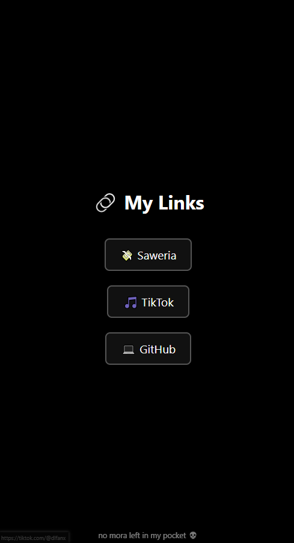

# dlfanx Goofy Ahh Links Page 💀

A minimalist dark-themed links page to showcase your top links:
- Saweria (support me!)
- TikTok (scroll if you dare)
- GitHub (chaotic code lives here)
- YouTube (more chaos in motion)

With bonus cursed footer:
> "no mora left in my pocket 💀"

## Features
- Black background for maximum edginess
- Simple HTML & CSS, no frameworks
- Hover effects, responsive buttons

## Preview

## Usage
1. Clone this repo
2. Replace links with your own
3. Deploy to GitHub Pages, Vercel, or Netlify

## Deploy Suggestions
- **GitHub Pages**: Just push to `main` and enable Pages
- **Netlify** / **Vercel**: Drag & drop or connect repo

## License
MIT, because chaos should be free.

---

Stay goofy, stay based 🗿
